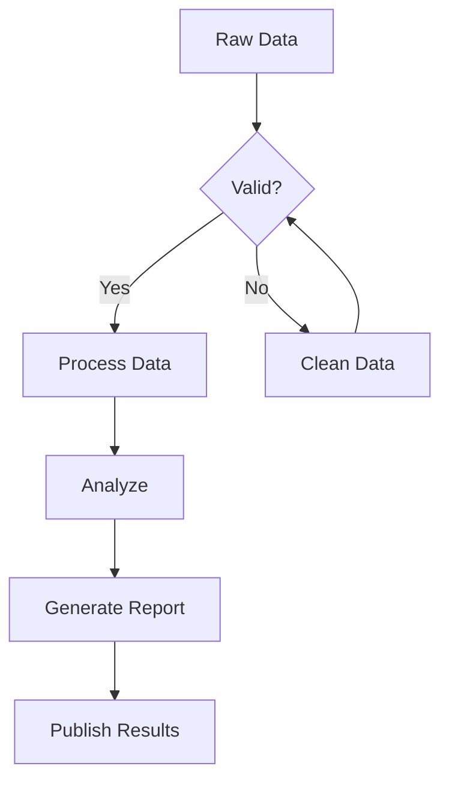
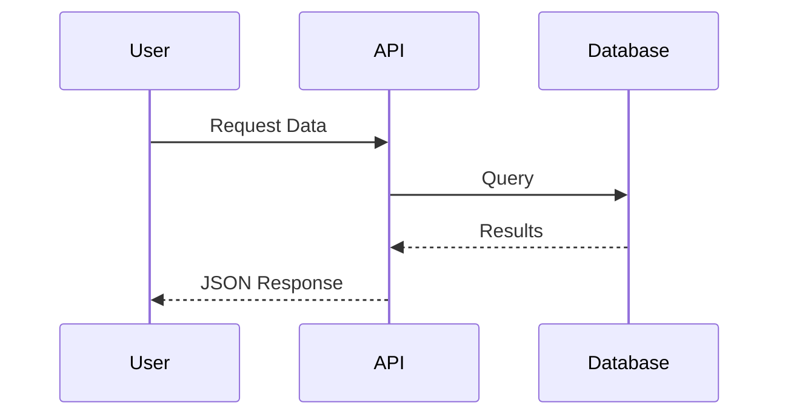
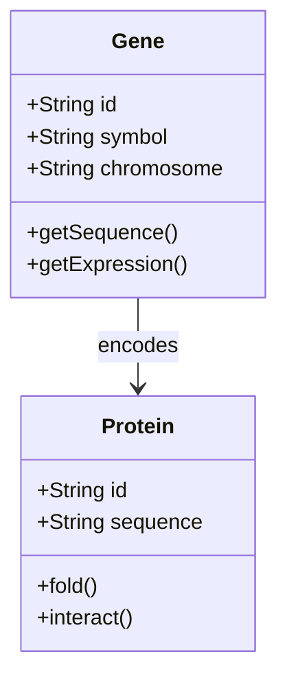

This post demonstrates all the features available in this scientific blog template. Use it as a reference when writing your own articles.

## Mathematical Equations

One of the core features is LaTeX math rendering via KaTeX. You can write inline equations like $E = mc^2$ or $\nabla \cdot \mathbf{E} = \frac{\rho}{\varepsilon_0}$ directly in your text.

For display equations, use the double dollar sign syntax:

$$
\int_{-\infty}^{\infty} e^{-x^2} dx = \sqrt{\pi}
$$

Here's a more complex example showing the Schrödinger equation:

$$
i\hbar\frac{\partial}{\partial t}\Psi(\mathbf{r},t) = \left[-\frac{\hbar^2}{2m}\nabla^2 + V(\mathbf{r},t)\right]\Psi(\mathbf{r},t)
$$

And the famous Euler's identity:

$$
e^{i\pi} + 1 = 0
$$

## Mermaid Diagrams

Create flowcharts, sequence diagrams, and other visualizations using Mermaid syntax.

### Flowchart Example



### Sequence Diagram



### Class Diagram



## Code Blocks

Syntax-highlighted code blocks with copy functionality:

### Python

```python
import numpy as np
from scipy import stats

def analyze_expression(data: np.ndarray) -> dict:
    """Analyze gene expression data."""
    return {
        'mean': np.mean(data, axis=0),
        'std': np.std(data, axis=0),
        'median': np.median(data, axis=0),
        'pvalue': stats.ttest_1samp(data, 0).pvalue
    }

# Example usage
expression_matrix = np.random.randn(100, 50)
results = analyze_expression(expression_matrix)
print(f"Mean expression: {results['mean'][:5]}")
```

### R

```r
library(tidyverse)
library(DESeq2)

# Load count data
counts <- read_csv("counts.csv") %>%
  column_to_rownames("gene_id")

# Create DESeq2 object
dds <- DESeqDataSetFromMatrix(
  countData = counts,
  colData = metadata,
  design = ~ condition
)

# Run differential expression analysis
dds <- DESeq(dds)
results <- results(dds, alpha = 0.05)
```

### Bash

```bash
#!/bin/bash
# Align reads with STAR

STAR --runMode alignReads \
     --genomeDir /path/to/genome \
     --readFilesIn reads_R1.fastq.gz reads_R2.fastq.gz \
     --readFilesCommand zcat \
     --outSAMtype BAM SortedByCoordinate \
     --outFileNamePrefix sample_ \
     --runThreadN 8
```

## Callouts and Admonitions


This is a note callout. Use it to provide additional context or supplementary information that readers might find helpful.




This is a warning callout. Use it to alert readers about potential pitfalls, deprecated features, or important caveats they should be aware of.




This is a tip callout. Use it to share best practices, shortcuts, or helpful suggestions that can improve the reader's workflow.




This is an important callout. Use it to highlight critical information that readers must not miss.




This is an example callout. Use it to provide concrete examples that illustrate concepts discussed in the text.



## Tables

Data tables with proper styling:

| Gene | Fold Change | P-value | FDR |
|------|-------------|---------|-----|
| BRCA1 | 2.45 | 0.001 | 0.005 |
| TP53 | -1.82 | 0.003 | 0.012 |
| EGFR | 3.21 | < 0.001 | 0.002 |
| MYC | 1.56 | 0.021 | 0.045 |
| KRAS | -2.10 | 0.002 | 0.008 |

## Figures with Captions

Images automatically get numbered captions:



## Lists

### Unordered List

- Primary analysis pipeline
  - Quality control
  - Read alignment
  - Quantification
- Statistical analysis
  - Differential expression
  - Pathway enrichment
- Visualization
  - Heatmaps
  - Volcano plots

### Ordered List

1. Collect samples
2. Extract RNA
3. Prepare libraries
4. Sequence
5. Analyze data
6. Interpret results

## Blockquotes

> "The most exciting phrase to hear in science, the one that heralds new discoveries, is not 'Eureka!' but 'That's funny...'"
>
> — Isaac Asimov

## Inline Code and Keyboard Shortcuts

Use `pip install numpy` to install NumPy. Press <kbd>Ctrl</kbd> + <kbd>C</kbd> to copy and <kbd>Ctrl</kbd> + <kbd>V</kbd> to paste.

## Footnotes

This is a statement that needs a citation[^1]. Here's another claim[^2].

[^1]: First reference with detailed information about the source.
[^2]: Second reference from a different publication.

## Links

- [External link to PubMed](https://pubmed.ncbi.nlm.nih.gov/)
- [Internal link to About page](/about/)

## Conclusion

This template provides all the tools you need for effective scientific communication. The combination of LaTeX math, Mermaid diagrams, syntax-highlighted code, and proper typography creates a professional reading experience.

Feel free to use this post as a reference when writing your own articles. Happy writing!
